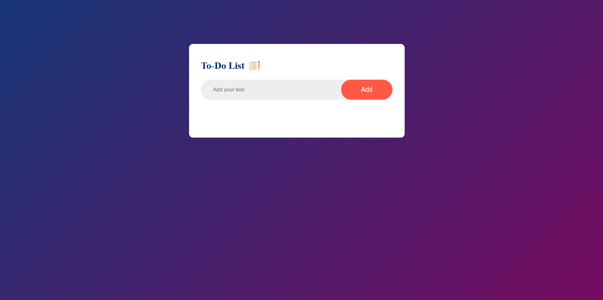
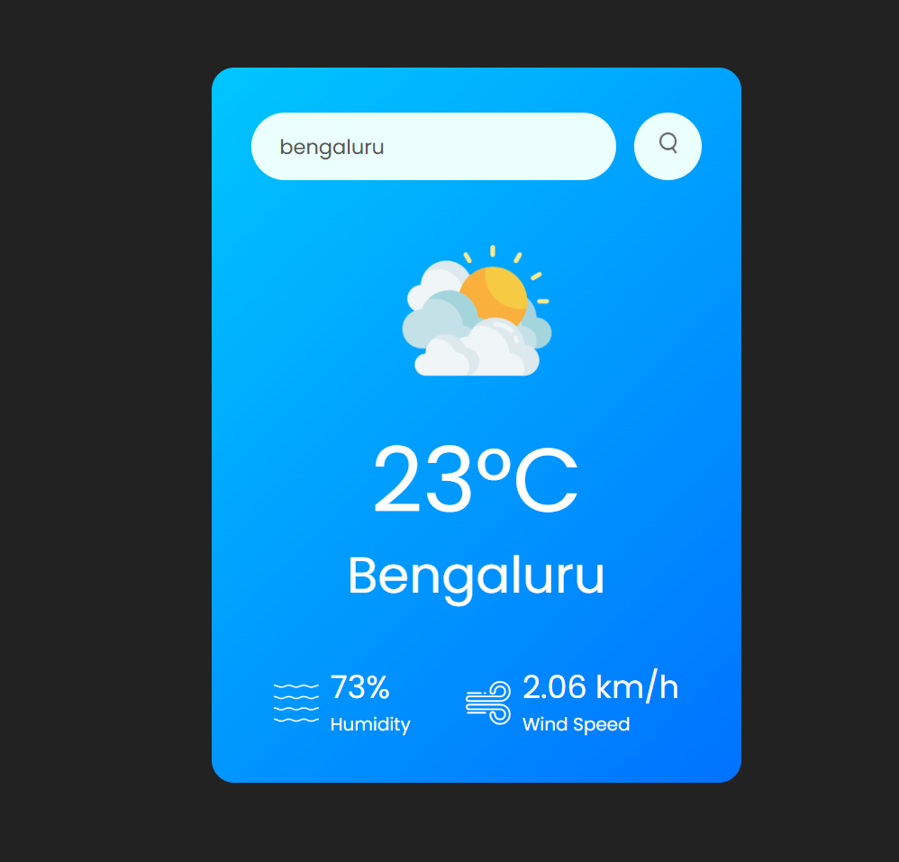
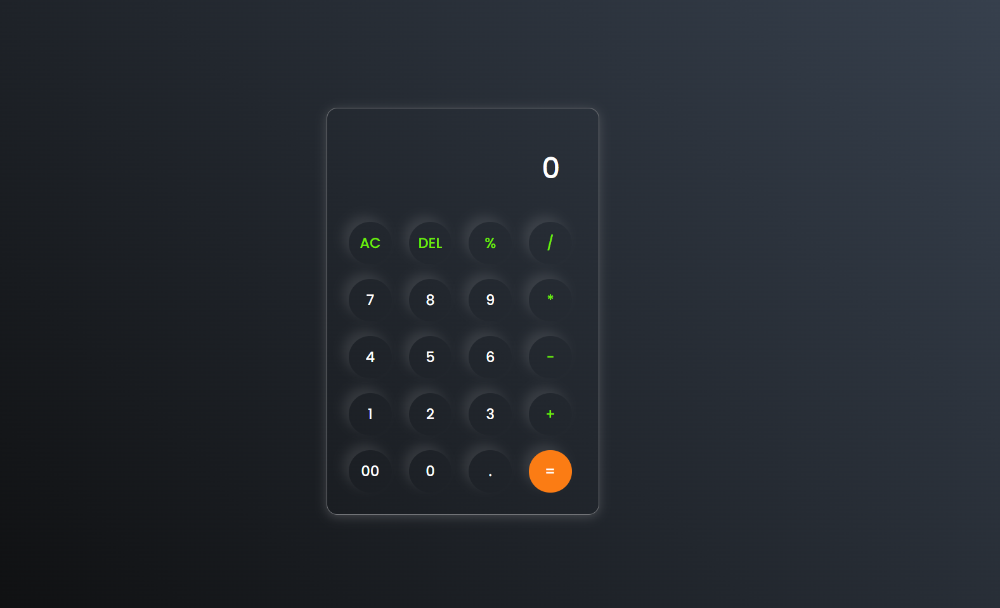
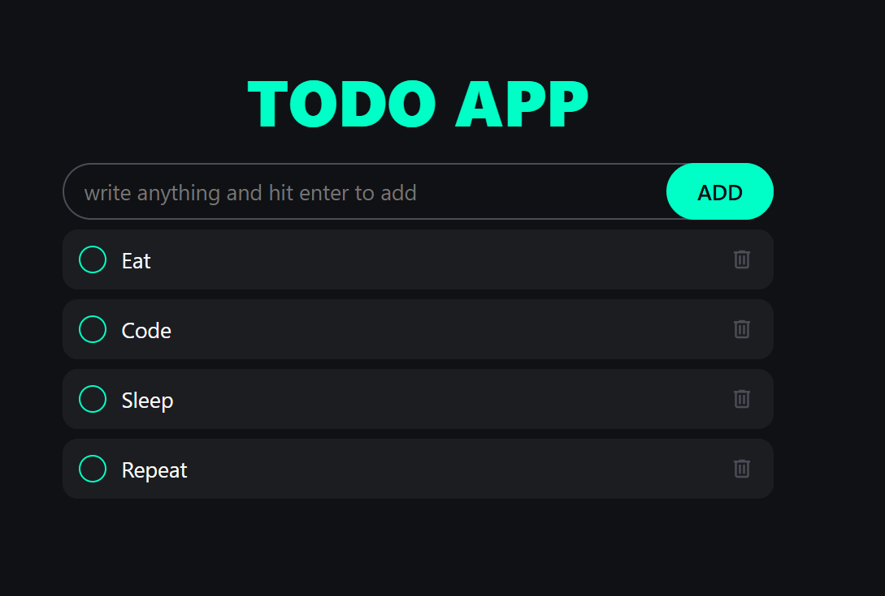

# 🌐 Web Development Projects
A collection of my front-end projects built using **HTML**, **CSS**, and **JavaScript**.  

---

## 🧩 Projects

| # | Project Name | Live Demo | Code | Preview |
|:-:|---------------|-----------|------|----------|
| 1 | 📝 To-Do App | [🔗 View](https://app.netlify.com/projects/todoapp0000000/overview) | [💻 Code](./projects/01-todo-app) |  |
| 2 | 🌤️ Weather App | [View](https://weatherappbyaayush.netlify.app/) | [Code](./projects/02-weather-app) |  |
| 3 | 🧮 Calculator App | [View](https://calculatorbyaayushhhhhhh.netlify.app/) | [Code](./projects/03-calculator-app) |  |
| 4 | 🧠 Quiz App | [View](https://quiiiiiiiiiiiiiizzzzzzzzapp.netlify.app/) | [Code](./projects/04-quiz-app) |  |
| 5 | 📝 Todo App2 | [View](https://chipper-baklava-9e8746.netlify.app/) | [Code](./projects/04-todo-app2) |  |

---

## 🧠 Skills Used

---

## 💬 About
👋 Hi, I’m **Biswaranjan Rout** — currently learning front-end development and building fun projects like this To-Do App.
